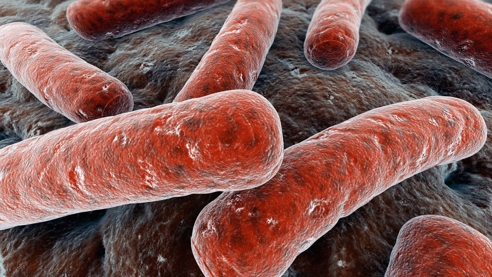

## May 2017 Independent Research Project 

## Tuberculosis Patterns in Comparison to Income, Weather, Demographics, Location

### Table of Contents
1. [Introduction](#Introduction)
    a. [What is tuberculosis?](#subparagraph1)
    b. [Signs and Symptoms](#subparagraph2)
    c. [Causes, Risks and Spread](#subparagraph3)
    d. [Diagnosis](#subparagraph4)
    e. [Treatment](#subparagraph5)
    f. [Stats](#subparagraph6)

### Introduction 

#### What is tuberculosis? 
Tuberculosis (TB) is an infectious disease traced to the bacterium *Mycobacterium tuberculosis*, a small
aerobic, and nonmotile bacillus. Some characteristics of this bacterium include high lipid content, slow division
(divides every 16-20 hours), outer membrance lipid bilayer, and adaptability to extreme conditions. 
Tuberculosis most often affects the lungs (pulmonary tuberculosis), but
in approximately 15-20% of cases, it spreads outside the lungs to other parts of the body (extrapulmonary tuberculosis. 
Spread to the lymph nodes is especially common in these cases. 
An infection of *Mycobacterium tuberculosis* does not always lead to active tuberculosis. Often, people infected by the
bacteria exhibit no symptoms and are not a source of infectional spread. In this case, the patient is diagnosed with latent tuberculosis 
(of which 10% go on to develop active tuberculosis)

#### Signs and Symptoms 
There are many symptoms associated with active tuberculosis. They include:
* Chronic coughing with blood
* Fever
* Night Sweats
* Weight Loss
* Loss of Appetite
* Fatigue
* Chest Pain
* Erosion of a pulmonary artery (**RARE**)
* Erosion Rasmussen's aneurysm (**RARE**)

#### Causes, Risks and Spread 
Tuberculosis is caused by the spread of bacteria between because through aerial droplet movement of the fluids of a
person infected with active tuberculosis, such as through coughing, spitting, speaking, sneezing, etc. 

Some risk factors that increase the chances of contracting tuberculosis are:
* HIV/AIDS infection (13% of all people with TB also have HIV/AIDS) 
* Ethnic Minorities (80% of people in Asian and African countries will test positive for TB)
* Smoking
* Malnutrition
* Living in an overcrowded environment
* Drug injection
* Alcoholism
* Diabetes
* Working or living in proximity to vulnerable people

#### Diagnosis 
Tuberculosis is diagnosed with a variety of medical techniques. Some of the common ones include chest x-rays and microscopic
examination of bodily fluids. Of the latter variety, the common analysis methods used include tuberculin skin test, blood tests,
or histological phlegm stains (using the Ziehl-Neelsen Stain or the Kinyoun Stain)

#### Treatment 

#### Stats 
In 2014, 9.6 million cases of active TB which resulted 1.5 million deaths. 
Common in developing countries
Decreases steadily year by year

